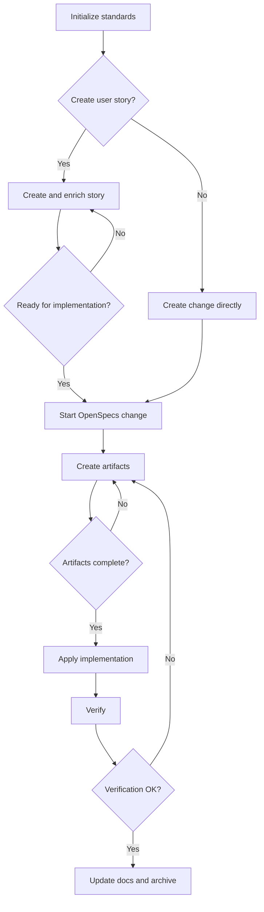

# Bootstrap Guide

## Purpose

This repository is a governed development starter kit for new and existing
projects. It uses OpenSpecs plus native Codex skills to enforce a
Spec-Driven Development workflow.

It provides:

- OpenSpecs workflow state under `openspec/`
- Codex repository instructions in `AGENTS.md`
- Native Codex skills under `.agents/skills/`
- Standards and documentation rules under `ai-specs/specs/`
- Bootstrap checks in `scripts/bootstrap.sh`

## 1. Create a New Project

Recommended:

1. Mark this repository as a GitHub template.
2. Create a new repository from the template.
3. Open the new repository in Codex.

Alternative:

1. Clone this repository.
2. Remove its `.git` folder.
3. Initialize a new Git repository.

## 2. Clean Project-Specific Content

Keep:

- `.agents/skills/`
- `ai-specs/`
- `openspec/`
- `AGENTS.md`
- `.gitignore`
- `README.md`
- `BOOTSTRAP.md`
- `docs/`
- `scripts/`

Remove or replace:

- Old product source code
- Previous domain-specific models
- Old CI config that does not apply
- Example APIs or dummy data

The governance and workflow system must remain intact.

## 3. Do Not Reinitialize OpenSpec

This repository is already initialized.

Do not run:

```bash
openspec init
```

Reinitializing OpenSpec can overwrite curated workflow structure and break the
governed lifecycle.

## 4. Minimum Requirements

Install:

- Git
- Node.js, if your OpenSpec installation uses npm or pnpm
- OpenSpec CLI
- Codex App, Codex CLI, or Codex IDE extension

Optional dependencies depend on the project stack you adopt.

## 5. Setup Steps

Clone the repository:

```bash
git clone <YOUR_REPO>
cd <YOUR_REPO>
```

Run the bootstrap script:

```bash
bash scripts/bootstrap.sh
```

The script verifies:

- You are in the repository root
- `AGENTS.md` exists
- `.agents/skills/` exists and contains workflow skills
- `openspec/` and `ai-specs/` exist
- OpenSpec CLI availability
- Codex CLI availability, when installed

## 6. Initialize Standards

If these files do not exist:

- `ai-specs/specs/backend-standards.mdc`
- `ai-specs/specs/frontend-standards.mdc`

choose one initialization workflow.

For a new project:

```text
$ai-specs-init-greenfield
```

For an existing codebase:

```text
$ai-specs-init-brownfield
```

The brownfield workflow discovers the stack, normalizes technical standards,
captures functional baseline specs, and leaves the project ready for
incremental SDD changes.

## 7. Create User Stories

Use:

```text
$ai-specs-new-us
```

or the aggregate user-story router:

```text
$ai-specs-user-story
```

The governed story pipeline can create, enrich, and hand off user stories for
implementation.

## 8. Start Development

Create a new OpenSpecs change:

```text
$opsx-new
```

Create or continue required artifacts:

```text
$opsx-continue
```

Apply completed tasks:

```text
$opsx-apply
```

Verify before archive:

```text
$opsx-verify
```

Archive when complete:

```text
$opsx-archive
```

## 9. Workflow Diagram



## 10. Troubleshooting

### Skills are not visible

- Confirm the repository root contains `AGENTS.md`.
- Confirm `.agents/skills/` exists.
- Restart the Codex session or app.
- Open the workspace at the repository root.

### OpenSpec command fails

- Run `bash scripts/bootstrap.sh`.
- Confirm the OpenSpec CLI is installed.
- Confirm `openspec/` exists.
- Do not run `openspec init` in this repository.

## 11. Documentation Rules

All technical documentation lives under:

```text
ai-specs/specs/
```

Templates live under:

```text
ai-specs/specs/templates/
```

Documentation is enforced before governed archive and commit workflows.

## Final Principle

This repository is not a product scaffold. It is a governed development
system.

Standards first. Specs first. Code second.
