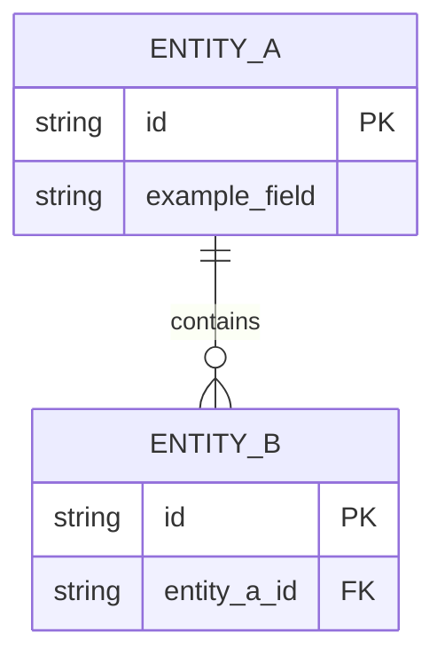

# Data Model Documentation

This document describes the project's data model, including entity descriptions, field definitions, relationships, constraints, and an entity-relationship diagram.

## Model Descriptions

Repeat the following structure for every persistent entity, aggregate root, collection, or externally managed record that forms part of the system of record.

### 1. `<EntityName>`
Briefly describe the purpose of this entity and the business capability it supports.

**Fields:**
- `<fieldName>`: `<type>` — [purpose, nullability, defaults, constraints]
- `<fieldName>`: `<type>` — [purpose, nullability, defaults, constraints]

**Validation Rules:**
- [List input validation, uniqueness rules, bounds, enums, derived values, or domain invariants.]

**Relationships:**
- `<relationshipName>`: [one-to-one, one-to-many, many-to-many, embedded, polymorphic, or external reference]

### 2. `<EntityName>`
Repeat the same structure for the next entity.

**Fields:**
- `<fieldName>`: `<type>` — [purpose, nullability, defaults, constraints]

**Validation Rules:**
- [List relevant validation and invariants.]

**Relationships:**
- `<relationshipName>`: [relationship description]

### 3. `<EntityName>`
Repeat until all entities are documented.

**Fields:**
- `<fieldName>`: `<type>` — [purpose, nullability, defaults, constraints]

**Validation Rules:**
- [List relevant validation and invariants.]

**Relationships:**
- `<relationshipName>`: [relationship description]

## Entity Relationship Diagram

Replace the sample entities above with the actual entities and cardinalities from the project.

## Key Design Principles

- [Describe normalization or denormalization choices.]
- [Describe timestamp, auditing, soft-delete, tenancy, or ownership conventions.]
- [Describe identifier strategy, referential integrity, and lifecycle rules.]

## Notes

- [Document assumptions, unresolved questions, or areas that require verification against code or database migrations.]
- [Reference the source of truth when part of the model is managed outside the main repository.]
